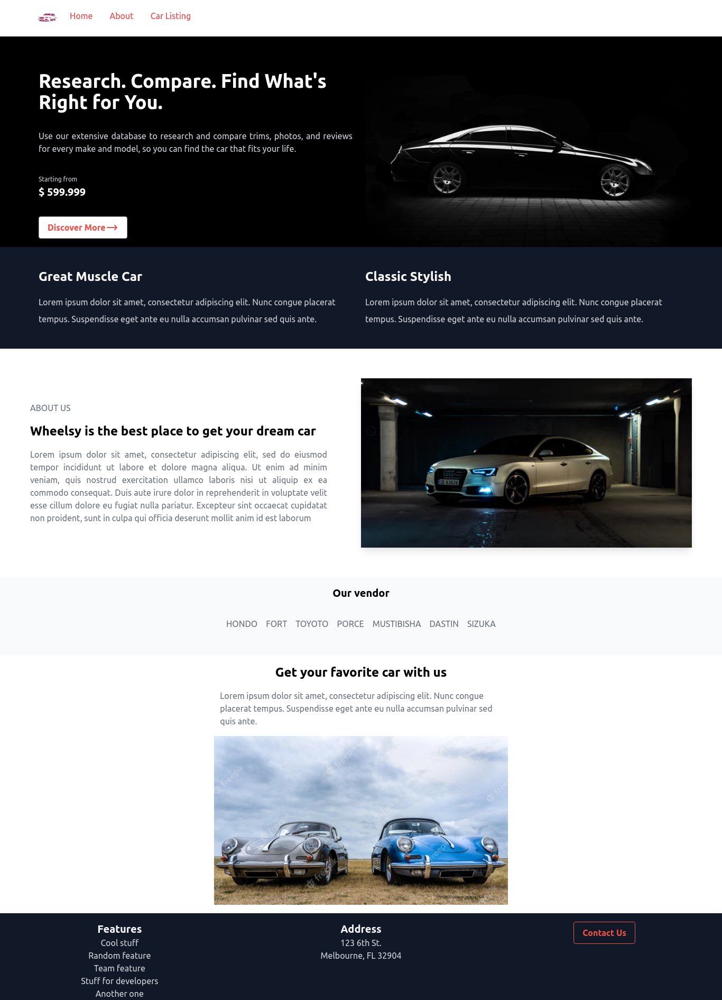
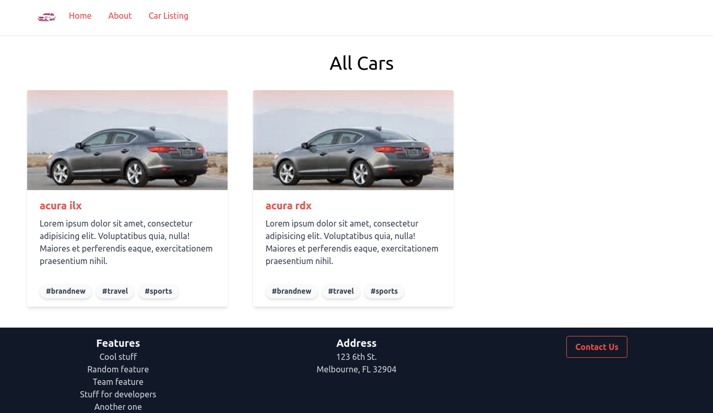
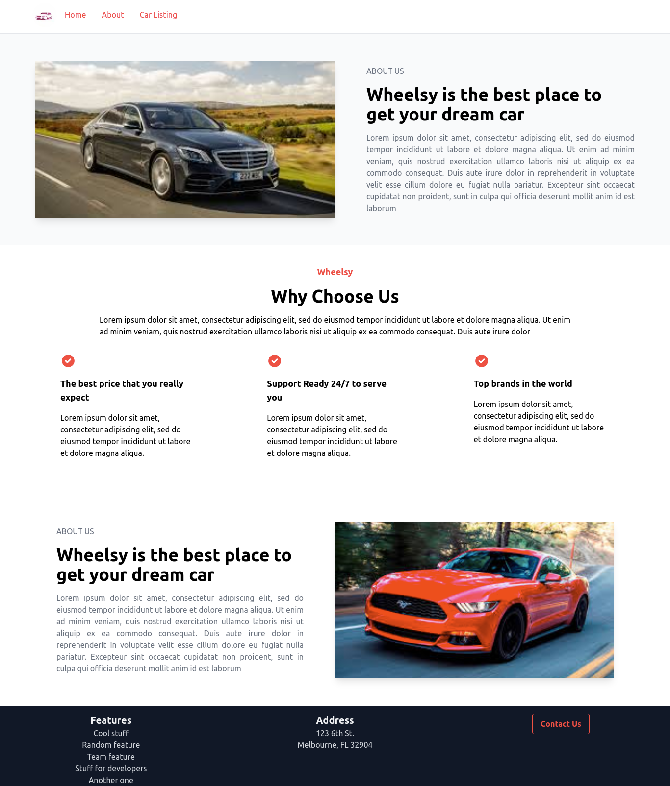

# Wheelsy 

This Web App provides car buyers and sellers the best platform. Browse new cars online and get full information about car and schedule test drive. Browse new cars online and get full information about car and schedule test drive.

## Technologies Used

- Nextjs (React Framework)
- Strapi (Node JS CMS)
- MongoDB
- GraphQL

## Getting Started

```bash
clone the project
git clone https://github.com/TasfiaIslam/wheelsy.git
```
- Backend
```bash
cd backend
npm run develop

#Then visit http://localhost:1337/admin to view the backend.
```

- Frontend 
```bash
cd wheelsy-frontend
npm run dev

#Then visit http://localhost:3000 to view the app.
```

## Quick View
- Landing Page

---
- Car Listing

---
- About 



## Features

* Show all cars listing
* View individual car details
